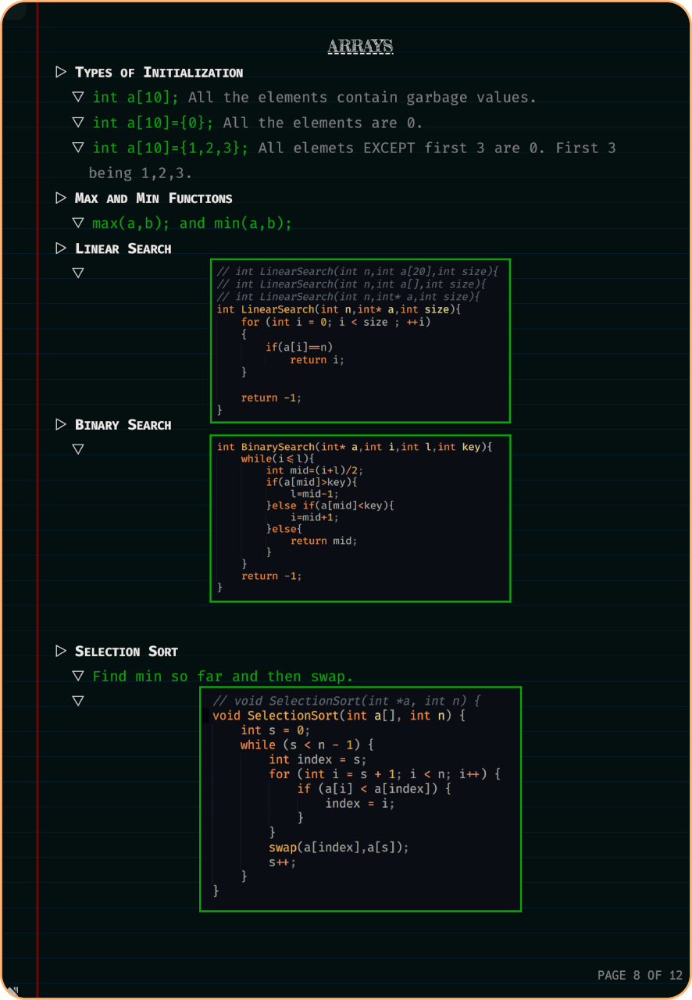
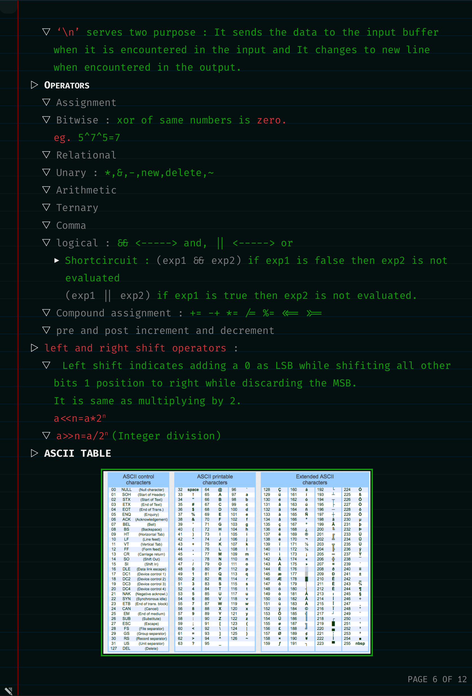

<!--
* @Author: Mohit Pathak
* @Date:   2021-01-30 03:39:33
* @Last Modified by:   Mohit Pathak
* @Last Modified time: 2021-02-02 10:05:09
 -->

---

---

 

 

---

## ▶ About Me :

 

▼ I am a **Computer Engineering** undergrad at **J.C. Bose University of Science and Technology, YMCA**🎓 
▼ I ❤ to </> and build cool stuff 😃 
▼ I ❤ aesthetic UIs, Designs and Customizing. 
▼ I like to sing 🎤 and I was a participant at the West Zone Badminton Championship (CBSE) 🏸 held at Yugantar Public School, Rajnandgaon, Chattisgarh (India) in 2012. 
▼ I am "positively" addicted to Runner's High and I am a 5K Jogger.🏃 

 

---

## ▶ My PGP Key :

▼ [Get My PGP Key][pgp]

---

## ▶ Get In Touch :

[◥ ][linkedin]&nbsp;&nbsp;&nbsp;&nbsp;&nbsp;
[◥ ][github]&nbsp;&nbsp;&nbsp;&nbsp;&nbsp;
[◥ ][twitter]&nbsp;&nbsp;&nbsp;&nbsp;&nbsp;
[◥ ][telegram]&nbsp;&nbsp;&nbsp;&nbsp;&nbsp;
[◥ ][email]&nbsp;&nbsp;&nbsp;&nbsp;&nbsp;

 

---

## ▶ Things I Know :

◥ &nbsp;&nbsp;&nbsp;&nbsp;&nbsp;
◥ &nbsp;&nbsp;&nbsp;&nbsp;&nbsp;
◥ &nbsp;&nbsp;&nbsp;&nbsp;&nbsp;
◥ &nbsp;&nbsp;&nbsp;&nbsp;&nbsp;
◥ &nbsp;&nbsp;&nbsp;&nbsp;&nbsp;
◥ &nbsp;&nbsp;&nbsp;&nbsp;&nbsp;
◥ &nbsp;&nbsp;&nbsp;&nbsp;&nbsp;
◥ 

 

---

## ▶ Currently Learning :

◥  
◥ 

 

---

## ▶ My Latest Projects :

▼ **[Charity Management System][project]**

 

---

## ▶ My Github Stats :

## ▼

 

---

## ▶ Some Cool Stuff I Built :

## ▼ Skin For Windows (The default was kinda boring 😬)

 

## ▼

 
**Fonts used here are\* _[Hack by source-foundry.][hack]_ 
**I am not the owner of the icons used in the dock.\*

 

## ▼ Cursors For Windows

[][material_light] 

## [Try It!][material_light]

[][volantes_light] 

## [Try It!][volantes_light]

[][volantes_dark] 

## [Try It!][volantes_dark]

\*\*Software used : Adobe Illustrator
 

 

---

## ▶ My Designs For Making Notes :

 

## ▼

 

## ▼

 
**Fonts used here are [FiraCode by Nikita Prokopov.][firacode]_ 
**I used [Libreoffice][libreoffice] to make the notes.

 

---

---

[email]: <mailto: pmohitb3011@gmail.com>
[linkedin]: https://www.linkedin.com/in/aystic/
[twitter]: https://twitter.com/aystic0_0
[github]: https://github.com/aystic
[project]: https://github.com/aystic/CharityManagementSystem
[telegram]: https://t.me/aystic0_0
[hack]: https://github.com/source-foundry/Hack
[firacode]: https://github.com/tonsky/FiraCode
[libreoffice]: https://www.libreoffice.org/
[pgp]: https://aystic.github.io/PublicKey/
[material_light]: https://www.deviantart.com/aystic/art/Material-Light-879897389
[volantes_dark]: https://www.deviantart.com/aystic/art/Volantes-Dark-879809065
[volantes_light]: https://www.deviantart.com/aystic/art/Volantes-Light-879954119
