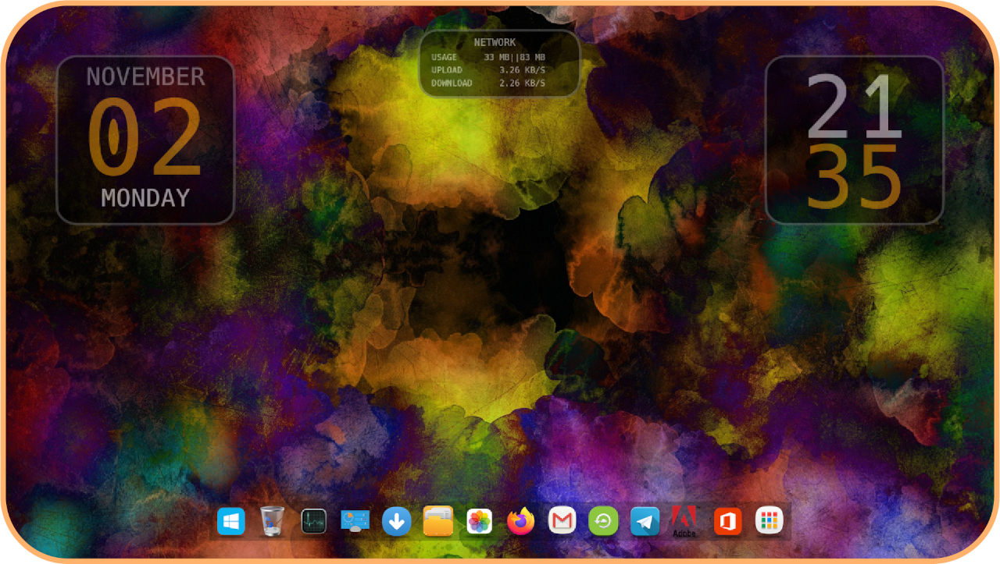
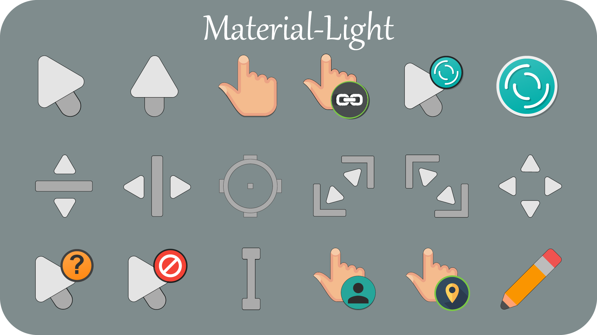
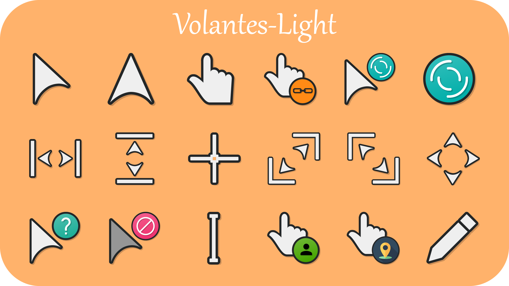
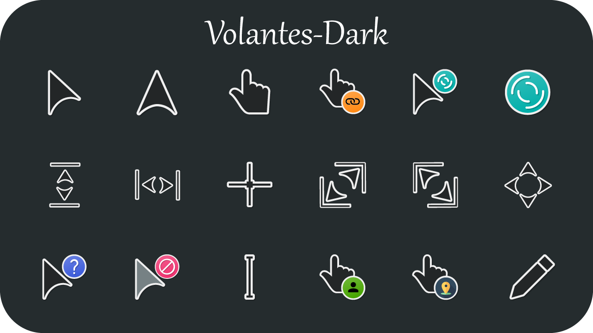

<!--
* @Author: Mohit Pathak
* @Date:   2021-01-30 03:39:33
* @Last Modified by:   Mohit Pathak
* @Last Modified time: 2022-03-23 18:20:09
 -->

---

---

 

 

---

## ▶ About Me :

 

▼ I am a **Computer Engineering** undergrad at **J.C. Bose University of Science and Technology, YMCA**🎓 
▼ I ❤ to </> and build cool stuff 😃 
▼ I ❤ aesthetic UIs, Designs, Customizing & exploring things. 

 

---

## ▶ My PGP Key :

▼ [Get My PGP Key][pgp]

---

## ▶ Get In Touch :

[][linkedin]&nbsp;&nbsp;&nbsp;&nbsp;&nbsp;
[][telegram]&nbsp;&nbsp;&nbsp;&nbsp;&nbsp;
[][email]&nbsp;&nbsp;&nbsp;&nbsp;&nbsp;

 

---

## ▶ My Latest Projects :

▼ **[PigGame][project5]** 
▼ **[Ready...Steady...Do!][project2]** 
▼ **[Charity Management System][project1]** 
▼ **[GetDaKolor][project3]** 
▼ **[GuessMyNumber][project4]** 

 

---

## ▶ My Github Stats :

## ▼

 

 

---

  

 

---

## ▶ Some Stuff I Built :

## ▼ Skin For Windows

 

 
**Fonts used here are [Hack by source-foundry.][hack] 
**I am not the owner of the icons used in the dock.

 

## ▼ Cursors For Windows

[][material_light] 

## [Try It!][material_light]

[][volantes_light] 

## [Try It!][volantes_light]

[][volantes_dark] 

## [Try It!][volantes_dark]

\*\*Software used : Adobe Illustrator & RealWorld Cursor Editor
 

---

---

[email]: <mailto: itspmohit@gmail.com>
[linkedin]: https://www.linkedin.com/in/aystic/
[project1]: https://github.com/aystic/CharityManagementSystem
[project2]: https://readysteadydo.netlify.app
[project3]: https://aystic.github.io/GetDaKolor/
[project4]: https://aystic.github.io/GuessMyNumber/
[project5]: https://aystic.github.io/PigGame/
[telegram]: https://t.me/aystic0_0
[hack]: https://github.com/source-foundry/Hack
[firacode]: https://github.com/tonsky/FiraCode
[pgp]: https://aystic.github.io/PublicKey/
[material_light]: https://www.deviantart.com/aystic/art/Material-Light-879897389
[volantes_dark]: https://www.deviantart.com/aystic/art/Volantes-Dark-879809065
[volantes_light]: https://www.deviantart.com/aystic/art/Volantes-Light-880018331
