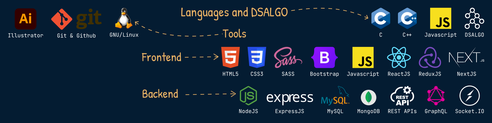

<!--
* @Author: Mohit Pathak
* @Date:   2021-01-30 03:39:33
* @Last Modified by:   Mohit Pathak
* @Last Modified time: 2022-07-26 07:12:53
 -->

# Hi! Its Mohit here.&nbsp;

## ▶ About Me :

▼ I am a **Computer Engineering** undergrad at **J.C. Bose University of Science and Technology, YMCA**🎓 
▼ I am a **FullStack developer** having experience in working with **ReactJS, NodeJS, ExpressJS, MySQL, MongoDB**. 
▼ Currently I am building a fullstack SPA which will be useful in our daily lives as a productivity tool & exploring DevOps. 
▼ I adore **GNU/Linux**. 
▼ Beautiful UIs and Illustrations make me ecstatic. 
▼ Constantly exploring and learning new things. 

---

## ▶ Things I know :

---

## ▶ My PGP Key :

▼ [**Get My PGP Key**][pgp]

---

## ▶ Get In Touch :

[][linkedin]&nbsp;&nbsp;&nbsp;&nbsp;&nbsp;
[][telegram]&nbsp;&nbsp;&nbsp;&nbsp;&nbsp;
[][email]&nbsp;&nbsp;&nbsp;&nbsp;&nbsp;

---

## ▶ Things I made while learning and tinkering :

▼ **[NodeShop][project8]** 
▼ **[MusicParty][project10]** 
▼ **[SocialNetwork][project9]** 
▼ **[ReactMeals][project6]** 
▼ **[ReduxCart][project7]** 
▼ **[PigGame][project5]** 
▼ **[Ready...Steady...Do!][project2]** 
▼ **[Charity Management System][project1]** 
▼ **[GetDaKolor][project3]** 
▼ **[GuessMyNumber][project4]** 

---

## ▶ My Github Stats :

  

---

## ▶ Some Stuff I Built :

## ▼ Skin and Cursors For Windows

---

[email]: <mailto: itspmohit@gmail.com>
[linkedin]: https://www.linkedin.com/in/aystic/
[project1]: https://github.com/aystic/CharityManagementSystem
[project2]: https://github.com/aystic/ReadySteadyDo
[project3]: https://github.com/aystic/GetDaKolor
[project4]: https://github.com/aystic/GuessMyNumber
[project5]: https://github.com/aystic/PigGame
[project6]: https://github.com/aystic/ReactMeals
[project7]: https://github.com/aystic/ReduxCart
[project8]: https://github.com/aystic/NodeShop
[project9]: https://github.com/aystic/Social-Network
[project10]: https://github.com/aystic/MusicParty
[telegram]: https://t.me/aystic0_0
[hack]: https://github.com/source-foundry/Hack
[firacode]: https://github.com/tonsky/FiraCode
[pgp]: https://aystic.github.io/PublicKey/
[material_light]: https://www.deviantart.com/aystic/art/Material-Light-879897389
[volantes_dark]: https://www.deviantart.com/aystic/art/Volantes-Dark-879809065
[volantes_light]: https://www.deviantart.com/aystic/art/Volantes-Light-880018331
