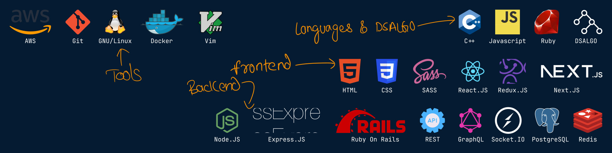

# Hi! Its Mohit here.&nbsp;

## ▶ About Me

▼ Graduated with a degree in Computer Engineering from J.C. Bose University of Science and Technology, YMCA, in 2023. 
▼ I am a passionate Software Engineer with experience in Ruby on Rails, ReactJS, Ruby, JavaScript, PostgreSQL, Docker, Linux, and AWS. 
▼ I adore GNU/Linux. My first “Eureka Moment” was when I built a simple website using HTML, CSS, and JS, and the second was when I dual-booted Ubuntu on my laptop and explored Linux. I have done my fair share of tinkering and hacking on different Linux systems and eventually settled on Fedora as my daily driver. 
▼ I am constantly exploring and learning new things. I like reading technical and personal development books and diving deep into the technical documentation of whatever fascinates me. 
▼ When not at my desk, you’ll find me either spending time in nature or carving corners on my motorcycle in the twisties. 

---

## ▶ Things I know

---

## ▶ My GPG Key

▼ [Get my public key][pgp-key]

---

## ▶ Get In Touch

[][linkedin]&nbsp;&nbsp;&nbsp;&nbsp;&nbsp;
[][telegram]&nbsp;&nbsp;&nbsp;&nbsp;&nbsp;
[][email]&nbsp;&nbsp;&nbsp;&nbsp;&nbsp;

---

## ▶ Things I made while learning and tinkering

▼ **[Realtime Customer Query Resolution][project11]** 
▼ **[The weather man][project12]** 
▼ **[NodeShop][project8]** 
▼ **[MusicParty][project10]** 
▼ **[SocialNetwork][project9]** 
▼ **[ReactMeals][project6]** 
▼ **[ReduxCart][project7]** 
▼ **[PigGame][project5]** 
▼ **[Ready...Steady...Do!][project2]** 
▼ **[Charity Management System][project1]** 
▼ **[GetDaKolor][project3]** 
▼ **[GuessMyNumber][project4]** 

---

## ▶ Some of my notes

▼ **[Git][notes1]** 
▼ **[C++ - STL][notes2]** 
▼ **[Using regex in JS][notes3]** 
▼ **[Docker (In progress)][notes4]** 

---

## ▶ My Github Stats

 

 

---

## ▶ Some Stuff I Built

## ▼ Skin and Cursors For Windows

---

[email]: <mailto: itspmohit@gmail.com>
[linkedin]: https://www.linkedin.com/in/aystic/
[project1]: https://github.com/aystic/CharityManagementSystem
[project2]: https://github.com/aystic/ReadySteadyDo
[project3]: https://github.com/aystic/GetDaKolor
[project4]: https://github.com/aystic/GuessMyNumber
[project5]: https://github.com/aystic/PigGame
[project6]: https://github.com/aystic/ReactMeals
[project7]: https://github.com/aystic/ReduxCart
[project8]: https://github.com/aystic/NodeShop
[project9]: https://github.com/aystic/Social-Network
[project10]: https://github.com/aystic/MusicParty
[project11]: https://github.com/aystic/CustomerQueryResolution
[project12]: https://github.com/aystic/theweatherman
[telegram]: https://t.me/aystic0_0
[notes1]: https://aystic.github.io/GitNotes/
[notes2]: https://aystic.github.io/CPP-STL/
[notes3]: https://aystic.github.io/jsRegex/
[notes4]: https://aystic.github.io/Docker/
[pgp-key]: https://github.com/aystic.gpg
